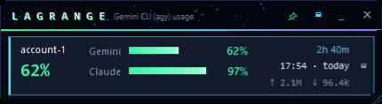

<div align="center">

# Lagrange - Gemini CLI (agy) Usage

**Park where the pull is balanced.**

A Windows desktop widget showing live **quota, token and context usage** for
Google's **Gemini CLI / Antigravity CLI** (`agy`) — and an account switcher to
go with it. It sits on top of your work, shrinks to a strip when you want it out
of the way, and folds into the tray as a gauge you can read at a glance. See
what is left across every account at once, how many tokens each has spent, how
full the current conversation's context window is — and switch between accounts
without leaving the console you are in.


</div>

<div align="center">
<sub>

quota meter · token usage · context window · account switcher ·
`agy` · Antigravity CLI · Gemini CLI · Windows · Linux · ChromeOS

</sub>
</div>

---

## This is the ChromeOS Crostini fork

[Lagrange - Gemini CLI (agy) Usage](https://github.com/Vovka666/antigravity-gemini-usage-widget)
started Windows-only, like its Claude Code sibling — the same
`ctypes`-into-`user32`/`gdi32`/`shell32` construction, plus `advapi32` for
Windows Credential Manager. This fork's history already carries most of the
Linux/X11 port: window shaping via the X Shape extension, monitor geometry
via XRandR, a tray fallback where ChromeOS's Crostini container has no panel
process to host one, and — since Windows Credential Manager does not exist on
Linux — credentials read from `~/.gemini/antigravity-cli/antigravity-oauth-token`
(matching where Antigravity's own Linux build keeps its live token) with
additional accounts under `~/.lagrange/credentials/`, mode `0600`.

What this fork adds on top, found by testing on an actual ChromeOS Crostini
session rather than assumed from the code:

- **The window was live and correctly drawn — and physically unreachable.**
  Crostini's window manager, Sommelier, does not honour an absolute screen
  position for a borderless (`overrideredirect`) window: unmanaged windows
  route through a Wayland popup path that silently drops the requested
  coordinates. Confirmed live, the same way as on the Claude Code sibling
  this fork already mirrors: moving an already-mapped window to a safe corner
  changed nothing. Fixed the same way — a normal, managed window specifically
  under Sommelier (detected via `_NET_SUPPORTING_WM_CHECK`, so a real Linux
  desktop keeps the fully borderless look) — trading a native ChromeOS
  titlebar above the widget's own for the window actually being reachable.
- **The shelf icon didn't match.** ChromeOS's shelf pairs a running window to
  its `.desktop` entry (and icon) by `WM_CLASS`; `StartupWMClass` in the
  `.desktop` file and the Tk `className` now agree (`lagrange-widget`).
- One live bug from the port: the compact view's own hide button still called
  a method renamed elsewhere (`_hide_to_tray`, no longer defined) and was
  gated behind a tray that never exists on Crostini — dead code that would
  have thrown the moment it *could* run. Fixed to match the title bar's own
  hide button: always shown, minimizes where there is no tray to hide into.

See **Install** below for ChromeOS/Crostini setup, and `git log` for the
commit-by-commit account — the bulk of the Linux port predates these fixes.
Windows is unmodified throughout.

---

## Why

Antigravity enforces real limits, but the CLI doesn't surface them, and if you
work across several accounts there's no way to see where you stand without
signing in and out. The community workarounds copy `~/.gemini/oauth_creds.json`
between folders and count log lines against a made-up "50 requests per day".

Both of those are wrong:

- **`agy` doesn't read that file.** Since 1.x it keeps its OAuth token in
  **Windows Credential Manager**, under `gemini:antigravity`. Swapping the JSON
  files changes nothing at all.
- **There is no daily request limit.** Google meters two *model groups* — Gemini,
  and Claude/GPT — each against a **5-hour** and a **weekly** window, in weighted
  tokens. One prompt is not one unit of anything.

Lagrange reads the same quota API the Antigravity UI itself uses, and swaps the
same credential entry `agy` actually reads.

## What you get

- **Real numbers.** Straight from `retrieveUserQuotaSummary` — the call
  Antigravity uses to draw its own indicator. Remaining fraction and reset time
  for every group and window.
- **All accounts at once.** Inactive accounts are refreshed offline with their
  own refresh tokens, so you can see which one has room *before* switching.
- **The tokens behind the percentage.** Every card says what that account sent
  and received inside each quota window, and an *All accounts* card adds the
  fleet up — plus how full the last conversation's context window is. See
  [Where the token figures come from](#where-the-token-figures-come-from).
- **Switching that doesn't cost you your session.** Run `agy` through
  `lagrange run` and a switch takes effect in the **same console**, resuming the
  same conversation. No second window, no lost scrollback.
- **Switching before you notice.** Put your accounts in the order you want them
  used and Lagrange can hand the credential on by itself when the one in play
  runs low, leaving a slice for small tasks. Off by default — see
  [Account order and auto-switching](#account-order-and-auto-switching).
- **Out of the way when you want it.** Compact mode shrinks it to a heads-up
  display of the account in use — one big number for the tightest window, a
  meter per model group, the tokens spent in the last five hours; the tray icon
  is itself a gauge, so you can hide the window and still see where you stand.
- **Easy on the eyes.** Rounded corners, a deep-space palette, gradient meters
  and a horizon line that pulses when new figures land. `"effects": false`
  turns the motion off and keeps the layout.
- **Nothing in the clear.** Every account's token lives in Windows Credential
  Manager. On disk Lagrange keeps only email addresses and window position.
- **Says when it breaks.** `lagrange doctor` checks every assumption
  independently and names the one that moved. See [Staying compatible](#staying-compatible).

## Requirements

| | |
|---|---|
| OS | Windows 10/11 (token in Windows Credential Manager), or Linux with an X server — including ChromeOS's Crostini container — (token in `~/.gemini/antigravity-cli/`) |
| Python | 3.10+ with tkinter (the standard python.org installer includes it; on Linux, `sudo apt install python3-tk` if missing) |
| Antigravity | `agy` installed and signed in. Verified against **1.1.22** |

No third-party packages. Standard library only.

## Install

Two downloads on the [releases page](https://github.com/Vovka666/antigravity-gemini-usage-widget/releases),
neither of which needs Python:

| | |
|---|---|
| `Lagrange-Widget-x.y.z-win-portable.exe` | One file. Put it anywhere and run it. |
| `Lagrange-Widget-x.y.z-win-folder.zip` | Unzip and run `Lagrange Widget.exe` inside. Starts faster, since there is nothing to unpack at every launch. |

Both are the same widget. Neither is signed, so SmartScreen will ask once —
*More info → Run anyway* — and the single file, which unpacks itself into
`%TEMP%` on each start, is the more likely of the two to bother an antivirus.

Prefer to run it from source, or want the CLI as well:

```powershell
git clone https://github.com/Vovka666/antigravity-gemini-usage-widget.git
cd antigravity-gemini-usage-widget
powershell -ExecutionPolicy Bypass -File scripts\install.ps1
```

That creates a desktop shortcut and checks your setup. To also let account
switches apply in place, point the installer at the batch files you launch
Antigravity with:

```powershell
powershell -ExecutionPolicy Bypass -File scripts\install.ps1 `
    -Launchers @("C:\tools\agy_standard.bat", "C:\tools\agy_nonstop.bat")
```

Each launcher is backed up as `<name>.bak` and rewritten to open the widget and
start `agy` through `lagrange run`.

Prefer pip? `pip install .` gives you `lagrange` and `lagrange-widget` on PATH.
Without either, run everything through `bin\lagrange.cmd`.

### Linux / ChromeOS (Crostini)

```bash
git clone https://github.com/Vovka666/antigravity-gemini-usage-widget.git
cd antigravity-gemini-usage-widget
sudo apt install python3-tk     # if `python3 -c "import tkinter"` fails
bash scripts/install_linux.sh   # launchers + app-menu entry, no pip involved
lagrange-widget                 # the widget ("lagrange" alone is the CLI)
```

No pip install here either — the installer points `~/.local/bin/lagrange` and
`~/.local/bin/lagrange-widget` straight at the cloned repo (`PYTHONPATH`, not
a copy), plus a `.desktop` entry ChromeOS's own app launcher picks up on its
own. Moving or deleting the clone means re-running the installer.

**On ChromeOS's Crostini container specifically**, the window keeps its own
title bar but also gets a native ChromeOS one above it, rather than the fully
borderless look Windows gets — Crostini's compositor (Sommelier) cannot
reliably place or even show a truly borderless window, confirmed live, so the
widget asks for a normal, decorated one there instead. A real Linux desktop
(GNOME, KDE, XFCE) does not have this problem and keeps the borderless look.

### Building the executables yourself

```powershell
pip install pyinstaller
python scripts\build_exe.py           # dist\Lagrange Widget.exe — one file, ~11 MB
python scripts\build_exe.py --onedir  # a folder instead; starts faster
python scripts\build_exe.py --release # both, named and staged in dist\release
```

The executable is the widget only. The CLI stays a console program, because
`lagrange run` has to have a console to start Antigravity in.

Verify:

```
bin\lagrange.cmd doctor
```

## Use

Open the widget from the desktop shortcut, or let your Antigravity launcher open
it. Running it twice raises the existing window rather than opening a second.

| | |
|---|---|
| 📌 | Keep on top (remembered) |
| ▭ | Compact: just the account in use, one bar per model group |
| ▁ | Hide to the tray |
| ✕ | Quit |
| click a collapsed card | Expand that account |
| mouse wheel | Scroll the account list when it is taller than the screen |
| **Switch** | Load that account into Antigravity |
| **+ Add account** | Sign in through the browser; the active account is untouched |
| ⟳ | Refresh now (otherwise every 60 s) |

Bars are green above 50 %, amber from 20 to 50 %, red below. Each window shows
both how long is left and when it refills — the clock time if that is today, a
short date (`Sep 4`) if it is not.

Compact is the whole widget shrunk to the account in use: the tightest window as
one large number with its reset under it, a meter per model group, the tokens
that went out in the last five hours, and how full the last conversation's
context window is. Its **All accounts** button and the hide control come with
it, so nothing is a dead end.

Compact can be resized by hand: drag its right edge, its bottom, or the corner
handle. The meters stretch to the width you give them, the size is remembered,
and a window dragged short and wide switches to a strip layout — identity and
the big number on the left, meters in the middle, reset time and tokens on the
right — which sits along the top of a screen without wasting a row.

Switching between the two keeps the corner the widget is parked against — from
the bottom right the full view grows up and to the left, never off the screen —
and each size remembers its own position, so collapsing lands the small window
back where you left it. If the list is taller than your screen, the window stops
at what fits and the accounts scroll under the wheel:


### From the tray

Hidden, Lagrange keeps refreshing, and its icon is the gauge: a ring filled to
your tightest remaining window, in the same three colours. Hover for every
number, click to bring the widget back, right-click for Show, **Always on top**,
**Refresh now** and **Quit**.

Windows 11 files new tray icons under the `^` chevron — drag it onto the taskbar
once to keep it visible.

### Switching in the same console

`agy` reads its credential **once, at startup** — a running session cannot pick
up a new account (verified: a swap under a live process produces no second
`applyAuthResult` in its log). So a switch needs a restart. The question is only
whether you lose your window.

Start Antigravity through the wrapper:

```
lagrange run                                  # or: bin\lagrange.cmd run
lagrange run --dangerously-skip-permissions   # your own flags still work
```

Then, after you press **Switch**:

1. The widget swaps the credential and raises a restart request.
2. **Nothing is interrupted.** Whatever `agy` is doing keeps going.
3. When you leave Antigravity (`/exit` or Ctrl+C), the wrapper relaunches it
   right there — same console — with `--continue`, so you land back in the same
   conversation on the new account.

Without the wrapper the widget falls back to offering your launchers, which open
a new console.

Dragged short and wide, compact becomes a strip — identity and the big number on
the left, meters in the middle, reset time and tokens on the right:



### Account order and auto-switching

List your accounts best-first in `~/.lagrange/config.json` and the widget uses
that order everywhere — in the list, and when reaching for the next account:

```json
{
  "account_priority": ["work@example.com", "spare@example.com"],
  "auto_switch": true,
  "auto_switch_used_fraction": 0.85,
  "auto_switch_window": "5h",
  "auto_switch_pool": ["spare@example.com"]
}
```

With `auto_switch` on, when the loaded account's five-hour window drops below
what `auto_switch_used_fraction` leaves (15 % here), Lagrange loads the next
account in the order that still has headroom. It never interrupts anything: the
running session keeps the account it started with and finishes on that last
slice, and the new one takes effect at the next `agy` start — in the same
console, if you launched through `lagrange run`.

The decision is made on the *loaded* account rather than the running one, so it
settles after a single switch instead of firing on every refresh. Switches made
this way are recorded as `auto`, and `lagrange status` will say so.

`auto_switch_pool` limits which accounts may be touched. Set it when other tools
on the machine drive `agy` on their own schedule: Antigravity has one credential
slot per machine, and an unrestricted auto-switch will happily move it out from
under a job that is mid-run. Empty means "all of them", which is right for one
person at one console.

### Where the token figures come from

Google's quota endpoint answers in fractions — *how much of the window is left* —
and never in tokens. So the token counts come from the other side: Antigravity
writes one SQLite file per conversation under
`~/.gemini/antigravity-cli/conversations`, and every model turn in it records
what that turn cost and when it happened. Lagrange reads those files, read-only
and incrementally, and keeps a small ledger in `~/.lagrange/tokens.db`.

The field numbers are not documented anywhere — they were confirmed against a
source that names them. `agy -p --output-format json` prints a `usage` block for
the conversation it just ran, and the per-turn readings sum to it exactly:

```
$ agy -p "Say OK" --output-format json --model gemini-3.7-flash --effort low
... "usage":{"input_tokens":13668,"output_tokens":23,"thinking_tokens":22, ...}
```

Antigravity has one credential slot per machine and never writes down whose it
is, so it cannot say which account paid for a turn — but Lagrange is what moves
the credential. It keeps a timeline of which account was loaded when, and
attributes each turn to whoever was in place at the time. Turns from before the
ledger existed are reported as **unattributed** rather than assigned to a guess.

A quota window's start is its reset time minus the window's length, so "spent
this window" is the turns since — the same stretch of time the bar above it is
measuring.

Three keys in `~/.lagrange/config.json` control it:

| key | default | |
|---|---|---|
| `track_tokens` | `true` | Set to `false` to switch the ledger off entirely |
| `conversations_dir` | `""` | Empty means "find it" |
| `token_history_days` | `90` | `0` keeps everything |

One more key, unrelated to tokens: `"effects": false` stops the star field
breathing, the scan sweep and the horizon pulse. The layout and colours stay as
they are; the widget then repaints only when its numbers change.

### Command line

```
lagrange                    open the widget
lagrange run [agy args]     run Antigravity with in-place switching
lagrange list               accounts and remaining quota
lagrange usage              tokens per account and quota window
lagrange usage --by-day 30  daily totals
lagrange usage --by-model   which models the tokens went to
lagrange switch <email>
lagrange add
lagrange forget <email>
lagrange doctor [--json] [--quick]
```

## How it works

```
  Credential Manager                       cloudcode-pa.googleapis.com
  ┌────────────────────────┐               ┌──────────────────────────┐
  │ gemini:antigravity     │◄── swap ──┐   │ :retrieveUserQuotaSummary│
  │   ← what agy reads     │           │   └──────────┬───────────────┘
  │ lagrange:a@gmail.com   │           │              │ per account
  │ lagrange:b@gmail.com   │───────────┴──────────────┤ (offline refresh)
  └────────────────────────┘                          │
                                              ┌───────▼────────┐
   ~/.lagrange/accounts.json  (emails only)   │  the widget    │
   ~/.lagrange/config.json    (overrides)     └───────▲────────┘
   ~/.lagrange/tokens.db      (token counts)          │
                                                      │ per turn
                       ~/.gemini/antigravity-cli/conversations/*.db
```

Switching writes a stored copy over `gemini:antigravity`. Quota for accounts
that aren't active is read by refreshing their tokens offline, which is what
makes "look before you leap" possible.

Details, including everything discovered about Antigravity's internals, are in
[docs/ARCHITECTURE.md](docs/ARCHITECTURE.md).

## Staying compatible

Nothing here is a published API, so Lagrange assumes it will be changed and is
built to survive it:

- **Client credentials are lifted from your local `agy.exe`** at runtime and
  validated against Google before use — never hardcoded, never committed. If
  Google rotates them, the next run picks up the new pair by itself.
- **The credential entry is rediscovered** by shape if it's ever renamed.
- **Endpoint names are read from the binary** and compared with what's in use.
- **The quota response is parsed tolerantly** — unknown groups or windows render
  as themselves instead of crashing, so a new limit dimension just shows up.
- **Everything is overridable** in `~/.lagrange/config.json`, so a break can be
  patched locally the same hour, without waiting for a release.

When something does move, `lagrange doctor` says which layer:

```
[ ok ] agy.exe                 C:\Users\you\AppData\Local\agy\bin\agy.exe
                               version 1.1.22
[ ok ] credential entry        gemini:antigravity
[ ok ] oauth client validated  id …tent.com (len 73) · secret …qDAf (len 35)
[warn] quota endpoint          binary offers [...], config uses '...'
[ ok ] quota · yo***u@gmail.com  97% lowest bucket
                               shape: Gemini Models[5h/weekly], ...
```

The report redacts every secret and is meant to be pasted into an issue. See
[docs/COMPATIBILITY.md](docs/COMPATIBILITY.md) for what each failure means and
how to patch it yourself in the meantime.

## Security

- Tokens are stored only in Windows Credential Manager, in the same vault and
  format Antigravity uses.
- `~/.lagrange/` holds email addresses, window geometry and cached discovery
  results — no secrets.
- The token ledger stores counts, not content: how many tokens a turn cost, when
  it happened, which model and which account. Nothing of what was said is read
  out of Antigravity's conversation files, and they are only ever opened
  read-only.
- `lagrange doctor` prints lengths and last characters, never values.
- Sign-in is the standard OAuth loopback flow; the browser talks to Google, and
  Lagrange only ever sees the resulting code.

## Contributing

Issues and pull requests are welcome — start with
[CONTRIBUTING.md](CONTRIBUTING.md). If Antigravity has changed under you, open a
**compatibility** issue and attach `lagrange doctor --json`; that report usually
contains the whole diagnosis.

## License

MIT — see [LICENSE](LICENSE).

Not affiliated with Google. "Antigravity" and "Gemini" are trademarks of Google LLC.
