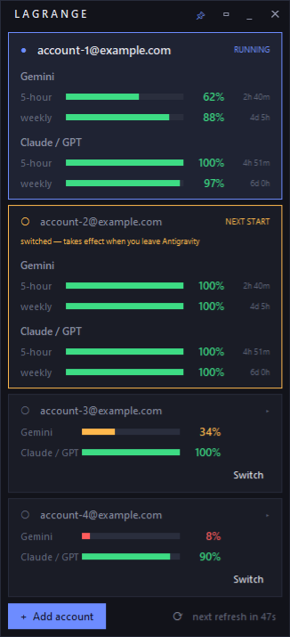
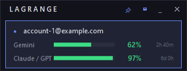

<div align="center">

# Lagrange

**Park where the pull is balanced.**

Live quota meter and account switcher for [Antigravity CLI](https://antigravity.google) (`agy`).
See what's left across every account at once — and switch between them without
leaving the console you're working in.



</div>

---

## Why

Antigravity enforces real limits, but the CLI doesn't surface them, and if you
work across several accounts there's no way to see where you stand without
signing in and out. The community workarounds copy `~/.gemini/oauth_creds.json`
between folders and count log lines against a made-up "50 requests per day".

Both of those are wrong:

- **`agy` doesn't read that file.** Since 1.x it keeps its OAuth token in
  **Windows Credential Manager**, under `gemini:antigravity`. Swapping the JSON
  files changes nothing at all.
- **There is no daily request limit.** Google meters two *model groups* — Gemini,
  and Claude/GPT — each against a **5-hour** and a **weekly** window, in weighted
  tokens. One prompt is not one unit of anything.

Lagrange reads the same quota API the Antigravity UI itself uses, and swaps the
same credential entry `agy` actually reads.

## What you get

- **Real numbers.** Straight from `retrieveUserQuotaSummary` — the call
  Antigravity uses to draw its own indicator. Remaining fraction and reset time
  for every group and window.
- **All accounts at once.** Inactive accounts are refreshed offline with their
  own refresh tokens, so you can see which one has room *before* switching.
- **Switching that doesn't cost you your session.** Run `agy` through
  `lagrange run` and a switch takes effect in the **same console**, resuming the
  same conversation. No second window, no lost scrollback.
- **Out of the way when you want it.** Compact mode shrinks it to the account in
  use; the tray icon is itself a gauge of your tightest window, so you can close
  the widget and still see where you stand.
- **Nothing in the clear.** Every account's token lives in Windows Credential
  Manager. On disk Lagrange keeps only email addresses and window position.
- **Says when it breaks.** `lagrange doctor` checks every assumption
  independently and names the one that moved. See [Staying compatible](#staying-compatible).

## Requirements

| | |
|---|---|
| OS | Windows 10 or 11 — `agy` stores its token in Windows Credential Manager |
| Python | 3.10+ with tkinter (the standard python.org installer includes it) |
| Antigravity | `agy` installed and signed in. Verified against **1.1.11** |

No third-party packages. Standard library only.

## Install

```powershell
git clone https://github.com/Vovka666/lagrange.git
cd lagrange
powershell -ExecutionPolicy Bypass -File scripts\install.ps1
```

That creates a desktop shortcut and checks your setup. To also let account
switches apply in place, point the installer at the batch files you launch
Antigravity with:

```powershell
powershell -ExecutionPolicy Bypass -File scripts\install.ps1 `
    -Launchers @("C:\tools\agy_standard.bat", "C:\tools\agy_nonstop.bat")
```

Each launcher is backed up as `<name>.bak` and rewritten to open the widget and
start `agy` through `lagrange run`.

Prefer pip? `pip install .` gives you `lagrange` and `lagrange-widget` on PATH.
Without either, run everything through `bin\lagrange.cmd`.

### A single .exe

To carry the widget to a machine without Python:

```powershell
pip install pyinstaller
python scripts\build_exe.py          # dist\Lagrange.exe — one file, ~11 MB
python scripts\build_exe.py --onedir # a folder instead; starts faster
```

The executable is the widget only. The CLI stays a console program, because
`lagrange run` has to have a console to start Antigravity in.

Single-file builds are unsigned and unpack themselves into `%TEMP%`, which some
antivirus products dislike on principle; `--onedir` avoids the unpacking.

Verify:

```
bin\lagrange.cmd doctor
```

## Use

Open the widget from the desktop shortcut, or let your Antigravity launcher open
it. Running it twice raises the existing window rather than opening a second.

| | |
|---|---|
| 📌 | Keep on top (remembered) |
| ▭ | Compact: just the account in use, one bar per model group |
| ▁ | Hide to the tray |
| ✕ | Quit |
| click a collapsed card | Expand that account |
| **Switch** | Load that account into Antigravity |
| **+ Add account** | Sign in through the browser; the active account is untouched |
| ⟳ | Refresh now (otherwise every 60 s) |

Bars are green above 50 %, amber from 20 to 50 %, red below.

Compact keeps the account in use and its two model groups, each showing whichever
window is tightest:



### From the tray

Hidden, Lagrange keeps refreshing, and its icon is the gauge: a ring filled to
your tightest remaining window, in the same three colours. Hover for every
number, click to bring the widget back, right-click for Show, **Always on top**,
**Refresh now** and **Quit**.

Windows 11 files new tray icons under the `^` chevron — drag it onto the taskbar
once to keep it visible.

### Switching in the same console

`agy` reads its credential **once, at startup** — a running session cannot pick
up a new account (verified: a swap under a live process produces no second
`applyAuthResult` in its log). So a switch needs a restart. The question is only
whether you lose your window.

Start Antigravity through the wrapper:

```
lagrange run                                  # or: bin\lagrange.cmd run
lagrange run --dangerously-skip-permissions   # your own flags still work
```

Then, after you press **Switch**:

1. The widget swaps the credential and raises a restart request.
2. **Nothing is interrupted.** Whatever `agy` is doing keeps going.
3. When you leave Antigravity (`/exit` or Ctrl+C), the wrapper relaunches it
   right there — same console — with `--continue`, so you land back in the same
   conversation on the new account.

Without the wrapper the widget falls back to offering your launchers, which open
a new console.

### Command line

```
lagrange                    open the widget
lagrange run [agy args]     run Antigravity with in-place switching
lagrange list               accounts and remaining quota
lagrange switch <email>
lagrange add
lagrange forget <email>
lagrange doctor [--json] [--quick]
```

## How it works

```
  Credential Manager                       cloudcode-pa.googleapis.com
  ┌────────────────────────┐               ┌──────────────────────────┐
  │ gemini:antigravity     │◄── swap ──┐   │ :retrieveUserQuotaSummary│
  │   ← what agy reads     │           │   └──────────┬───────────────┘
  │ lagrange:a@gmail.com   │           │              │ per account
  │ lagrange:b@gmail.com   │───────────┴──────────────┤ (offline refresh)
  └────────────────────────┘                          │
                                              ┌───────▼────────┐
   ~/.lagrange/accounts.json  (emails only)   │  the widget    │
   ~/.lagrange/config.json    (overrides)     └────────────────┘
```

Switching writes a stored copy over `gemini:antigravity`. Quota for accounts
that aren't active is read by refreshing their tokens offline, which is what
makes "look before you leap" possible.

Details, including everything discovered about Antigravity's internals, are in
[docs/ARCHITECTURE.md](docs/ARCHITECTURE.md).

## Staying compatible

Nothing here is a published API, so Lagrange assumes it will be changed and is
built to survive it:

- **Client credentials are lifted from your local `agy.exe`** at runtime and
  validated against Google before use — never hardcoded, never committed. If
  Google rotates them, the next run picks up the new pair by itself.
- **The credential entry is rediscovered** by shape if it's ever renamed.
- **Endpoint names are read from the binary** and compared with what's in use.
- **The quota response is parsed tolerantly** — unknown groups or windows render
  as themselves instead of crashing, so a new limit dimension just shows up.
- **Everything is overridable** in `~/.lagrange/config.json`, so a break can be
  patched locally the same hour, without waiting for a release.

When something does move, `lagrange doctor` says which layer:

```
[ ok ] agy.exe                 C:\Users\you\AppData\Local\agy\bin\agy.exe
                               version 1.1.11
[ ok ] credential entry        gemini:antigravity
[ ok ] oauth client validated  id …tent.com (len 73) · secret …qDAf (len 35)
[warn] quota endpoint          binary offers [...], config uses '...'
[ ok ] quota · yo***u@gmail.com  97% lowest bucket
                               shape: Gemini Models[5h/weekly], ...
```

The report redacts every secret and is meant to be pasted into an issue. See
[docs/COMPATIBILITY.md](docs/COMPATIBILITY.md) for what each failure means and
how to patch it yourself in the meantime.

## Security

- Tokens are stored only in Windows Credential Manager, in the same vault and
  format Antigravity uses.
- `~/.lagrange/` holds email addresses, window geometry and cached discovery
  results — no secrets.
- `lagrange doctor` prints lengths and last characters, never values.
- Sign-in is the standard OAuth loopback flow; the browser talks to Google, and
  Lagrange only ever sees the resulting code.

## Contributing

Issues and pull requests are welcome — start with
[CONTRIBUTING.md](CONTRIBUTING.md). If Antigravity has changed under you, open a
**compatibility** issue and attach `lagrange doctor --json`; that report usually
contains the whole diagnosis.

## License

MIT — see [LICENSE](LICENSE).

Not affiliated with Google. "Antigravity" and "Gemini" are trademarks of Google LLC.
